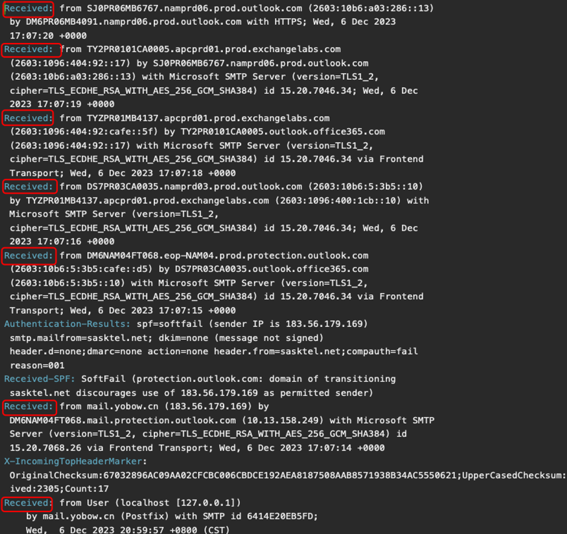

# Phishing Email Analysis Report

**Date of Analysis:** December 2023  
**Analyst:** Mohammed Anzil T A  

---

## 1. Introduction

In this lab, we conducted a deep-dive analysis of a suspicious email purporting to offer US\$16 million to the recipient. Our goals were to:

1. Trace the email’s path through mail servers.  
2. Inspect key header fields for inconsistencies.  
3. Validate sender reputation using OSINT.  
4. Determine whether the email is a phishing attempt.

---

## 2. Email Header Analysis

### 2.1 Mail Server Path (`Received` fields)

This email passed through **seven** `Received` hops. The **first** (topmost) entry indicates the final hop before delivery; the **seventh** (bottom) entry shows the initial server:

> **Closest to sender:** `mail.yobow.cn`

---

### 2.2 Authentication Results

- **SPF:** `softfail`  
  The sender IP (`183.56.179.169`) is **not** authorized in the domain’s SPF record, so it was marked as spam but still delivered.  
- **DKIM:** `none`  
- **DMARC:** `none`  

---

### 2.3 Envelope & Display Fields

- **Return-Path:** `p.chambers@sasktel.net`  
- **From:** `Mrs Janet Yellen <p.chambers@sasktel.net>`  
- **Reply-To:** `agentcynthiajamescontact01@gmail.com`  
- **To:** `Undisclosed recipients`  

The mismatch between **From** and **Reply-To**, plus undisclosed recipients, are classic phishing indicators.

---

### 2.4 Message Metadata

- **Subject:** `Attention Dear Beneficiary`  
- **Date:** `Wed, 6 Dec 2023 05:00:12 -0800`  
- **Message-ID:** `20231206125957.6414E20EB5FD@mail.yobow.cn`  
- **X-Mailer:** `Microsoft Outlook Express`  
- **Content-Type:** `text/html` (1 occurrence)

---

## 3. Email Body

The HTML-formatted body promises an inheritance of **16 million USD** and urges the recipient to reply to two “diplomatic agents”:

- **Cynthia R. James**  
  `agentcynthiajamescontact01@gmail.com`

- **John Williams**  
  `dr.philipmaxwell303@gmail.com`

Clearly, the offer is too good to be true and designed to lure victims into a reply.

---

## 4. OSINT & Reputation Checks

### 4.1 Sender Mail Server (`yobow.cn`)

- **Domain Creation:** July 18, 2014  
- **Location:** Beijing, China  
- **VirusTotal:** Multiple reports of similar spam/phishing campaigns.

---

### 4.2 Sender Domain (`sasktel.net`)

- **Domain Creation:** April 5, 2000  
- **Location:** Toronto, Canada  
- **WHOIS/DomainTools:** Legitimate ISP  
- **VirusTotal:** No vendor flags for phishing.

### 4.3 Sender IP (`183.56.179.169`)

- **AbuseIPDB:** Repeated spam reports  
- **IPVoid:** Flagged by 3 blacklists  
- **VPN Check:** Not associated with any VPN service  

---

## 5. Conclusions & Recommendations

1. **Phishing Indicators**  
   - SPF softfail  
   - Mismatched From/Reply-To  
   - Spam-reported IP  
   - Unrealistic financial promise  

2. **Action Items**  
   - **Delete** the email and block the sender.  
   - **Search** SIEM/email gateway logs for subject `"Attention Dear Beneficiary"` and any traffic to/from:
     - `p.chambers@sasktel.net`  
     - `agentcynthiajamescontact01@gmail.com`  
     - `dr.philipmaxwell303@gmail.com`  
     - Domain `sasktel.net`

3. **Next Steps**  
   - Notify users and the security team of this phishing campaign.  
   - Update email filtering rules to flag future messages from `yobow.cn`.  

---

*Report generated as part of Phishing Email Analysis Labs.*  
