# **First Phishing Email Analysis Documentation "16 million USD inheritance Scam"**

---

## 1. Aim

In this lab, I conducted an in-depth forensic analysis of a suspicious email received by a user. The objective was to verify its legitimacy and uncover any phishing tactics or malicious intent.

---

## 2. Email Header Analysis

### 2.1 Mail Server Path (`Received` fields)

The email traversed through **seven** `Received` headers. The **first (topmost)** represents the final mail server before delivery, while the **seventh (bottom)** reflects the originating server.

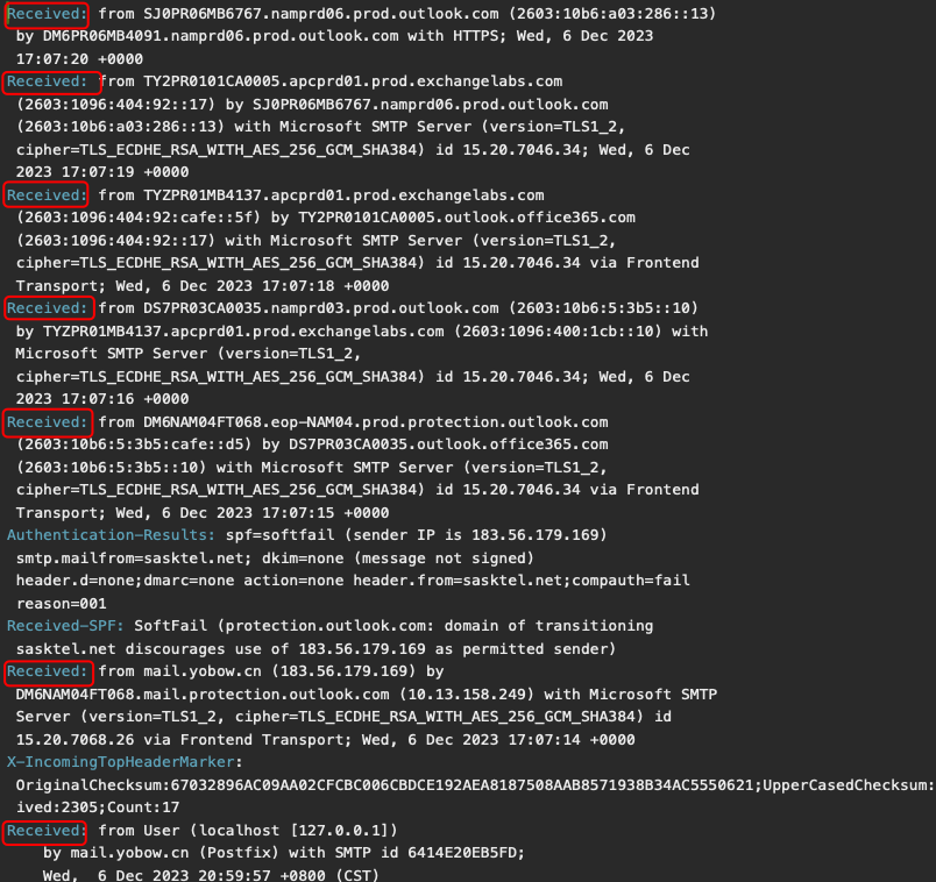
*Screenshot 1: Full list of Received headers showing mail flow path.*

> **Initial sending server:** `mail.yobow.cn`

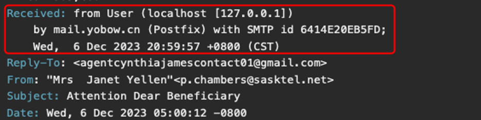
*Screenshot 2: Highlight of the closest sending server: `mail.yobow.cn`*

---

### 2.2 Authentication Results

* **SPF:** `softfail` – Sender IP (`183.56.179.169`) is not authorized in the domain’s SPF record.
* **DKIM:** `none`
* **DMARC:** `none`

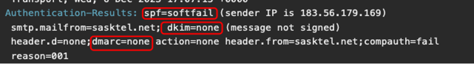
*Screenshot 3: Authentication results showing SPF softfail and lack of DKIM/DMARC.*

---

### 2.3 Envelope & Display Fields

| **Field**   | **Value**                                   |
| ----------- | ------------------------------------------- |
| Return-Path | `p.chambers@sasktel.net`                    |
| From        | `Mrs Janet Yellen <p.chambers@sasktel.net>` |
| Reply-To    | `agentcynthiajamescontact01@gmail.com`      |
| To          | `Undisclosed recipients`                    |

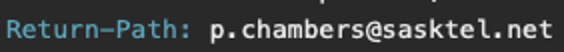

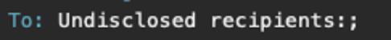

*Screenshot 4: Envelop & Display Fields.*

---

### 2.4 Message Metadata

| **Field**    | **Value**                                   |
| ------------ | ------------------------------------------- |
| Subject      | `Attention Dear Beneficiary`                |
| Date         | `Wed, 6 Dec 2023 05:00:12 -0800`            |
| Message-ID   | `20231206125957.6414E20EB5FD@mail.yobow.cn` |
| X-Mailer     | `Microsoft Outlook Express`                 |
| Content-Type | `text/html`                                 |

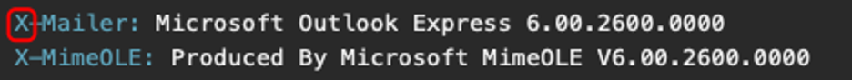
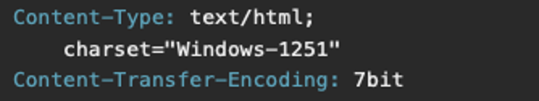

*Screenshot 5: Message Metadata.*

---

## 3. Email Body

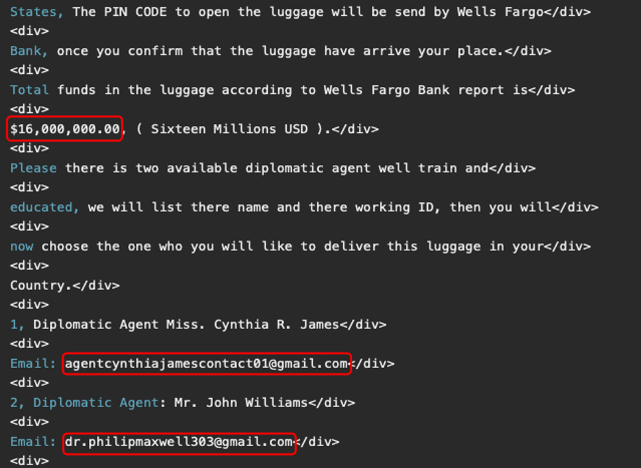
*Screenshot 6: Email body containing inheritance scam message.*

The email falsely claims that the recipient is entitled to a **16 million USD inheritance**, urging them to contact two alleged “diplomatic agents”:

* **Cynthia R. James** — `agentcynthiajamescontact01@gmail.com`
* **John Williams** — `dr.philipmaxwell303@gmail.com`

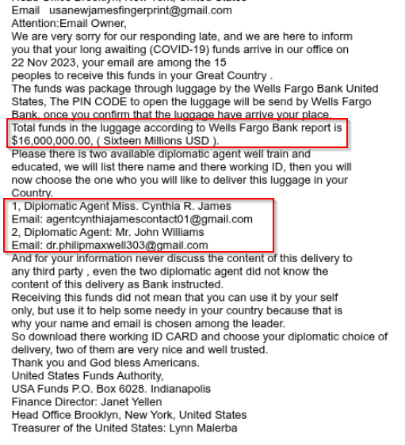

*Screenshot 7: Contact emails of agents embedded in the message.*

---

## 4. OSINT & Reputation Checks

### 4.1 Mail Server Domain – `yobow.cn`

* **Registered On**: July 18, 2014
* **Registered In**: Beijing, China
* **VirusTotal**: Associated with past spam and phishing activity.

.jpg)

*Screenshot 8: WHOIS information for `yobow.cn`.*

.jpg)

*Screenshot 9: VirusTotal result showing reputation of `yobow.cn`.*

---

### 4.2 Sender Domain – `sasktel.net`

* **Registered On**: April 5, 2000
* **Origin**: Toronto, Canada
* **WHOIS**: Legitimate ISP
* **VirusTotal**: No flags, appears clean.

.png)

*Screenshot 10: WHOIS information for legitimate domain `sasktel.net`.*

.png)

*Screenshot 11: VirusTotal check showing `sasktel.net` as clean.*

---

### 4.3 Sender IP – `183.56.179.169`

* **AbuseIPDB**: Multiple reports of spam activity.
* **IPVoid**: Flagged by 3 threat intelligence sources.
* **VPN Check**: No known VPN association.

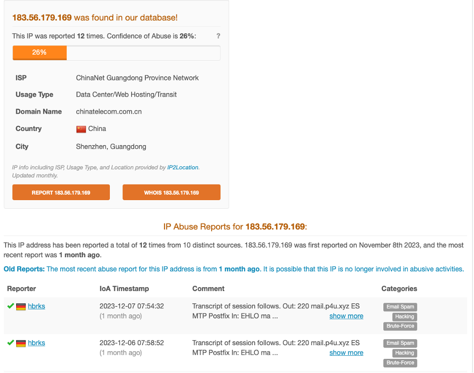
*Screenshot 12: AbuseIPDB shows multiple spam reports for the sender IP.*

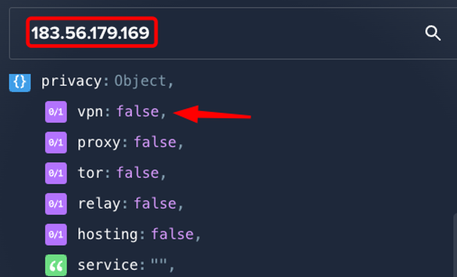
*Screenshot 13: VPN check shows IP not linked to proxy or VPN.*

---

## 5. Conclusions & Recommendations

### 5.1 Key Phishing Indicators

* ❌ **SPF Softfail** – Sending IP unauthorized.
* ❌ **Mismatched From/Reply-To** fields.
* ❌ **IP with poor reputation** – Associated with prior spam activity.
* ❌ **Fraudulent lure** – Unrealistic inheritance claim.

---

### 5.2 Action Items

* **Delete** the email and **block** the sender addresses.
* **Search** SIEM/email gateway logs for the subject `"Attention Dear Beneficiary"` and for:

  * `p.chambers@sasktel.net`
  * `agentcynthiajamescontact01@gmail.com`
  * `dr.philipmaxwell303@gmail.com`
  * Domain: `sasktel.net`

---

### 5.3 Next Steps

* Notify users and the security team about this phishing campaign.
* Add detection rules to flag domains like `yobow.cn`.
* Deploy email security filters against commonly abused templates and financial lures.

---

## 6. Skills Learned

* Email header Analysis
* Authentication protocols: SPF, DKIM, DMARC analysis
* OSINT investigation using WHOIS, VirusTotal, AbuseIPDB, IPVoid
* Social engineering detection based on structural and content-based cues

---

Let me know if you'd like this in Markdown for GitHub or exported as a printable PDF.
