# Phishing Email Analysis Documentation

---

## 1. Objective  
In this lab, I analyzed a suspicious email claiming an account lockout. My goals were:  
1. Trace the email’s path through Microsoft mail servers.  
2. Identify forged headers and malicious content.  
3. Validate sender reputation via OSINT.  
4. Confirm phishing intent through URL/file analysis.  

---

## 2. Email Header Analysis  

### 2.1 Mail Server Path (`Received` Fields)  
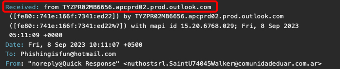  
*Screenshot 1: Email routed through Microsoft Outlook servers (`outlook.office365[.]com`).*  

**Key Observations**:  
- **Closest to sender**: Microsoft infrastructure (`mail-pf1-f856.outlook.office365[.]com`).  
- **Legitimate IP**: `40.107.215.98` (Microsoft-owned, low reputation weight).  

---

### 2.2 Authentication Results  
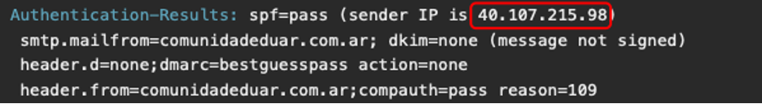  
*Screenshot 2: SPF passed (Microsoft IP), DKIM not configured.*  

| **Check** | **Result**       | **Implication**                          |  
|-----------|------------------|------------------------------------------|  
| SPF       | Pass             | IP authorized by Microsoft               |  
| DKIM      | None             | No domain validation                     |  
| DMARC     | BestGuessPass    | No DMARC policy for sender domain        |  

---

### 2.3 Envelope & Display Fields  
- **Return-Path**: `nuthostsrl.SaintU74045Walker@comunidadeduar[.]com.ar`  
- **From**: `noreply@Quick Response <nuthostsrl.SaintU74045Walker@comunidadeduar[.]com.ar>`  
- **To**: Undisclosed recipients  
- **Subject**: `We locked your account for security reason - Fri, September 08, 2023 10:11 AM`

  
  
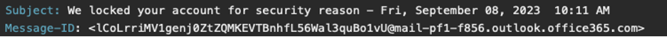  
*Screenshot 3: Envelope & Display Fields*

**Red Flags**:  
- Mismatched display name (`noreply@Quick Response`) vs. email domain.  
- Urgency-driven subject line.  

---

### 2.4 Message Metadata  
- **Date**: `Fri, 8 Sep 2023 10:11:07 +0500`  
- **Message-ID**: `<lCoLrriMV1genj0ZtZQMKEVTBnhfL56Wal3quBo1vU@mail-pf1-f856.outlook.office365.com>`  
- **X-Mailer**: `WebService/1.1.18291 YMailNorrin` (MacOS Chrome user agent)  
- **Content-Type**: `multipart/mixed` with boundary `NextPart`

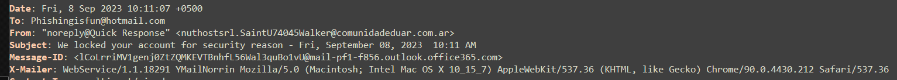
*Screenshot 4: Message Metadata*

"X-Mailer" value includes a user agent. This suggests that the attacker likely sent the email using a webmail interface, rather than the Outlook client. When we parse the user agent value using [User Agent Parser](https://explore.whatismybrowser.com/useragents/parse/#parse-useragent) we get
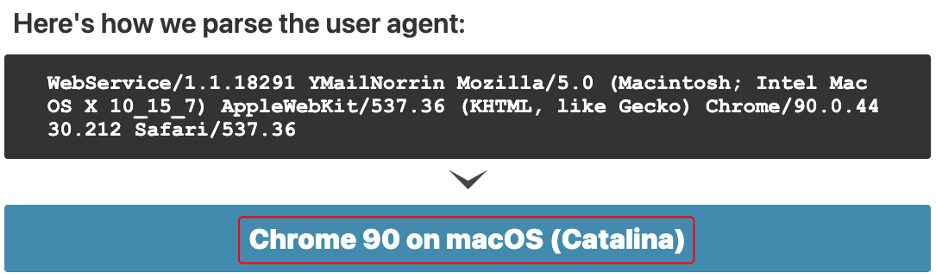

*Screenshot 5: Attacker used a webmail client (MacOS/Chrome).*  

---

## 3. Email Body & Attachments  

### 3.1 HTML Content  
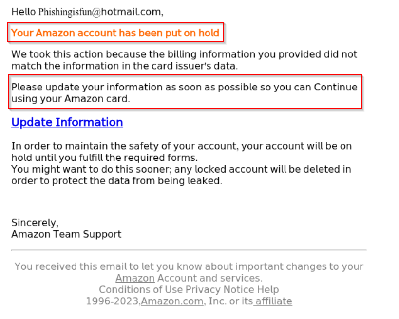  
*Screenshot 6: Fake account lockout warning with "secure your account" urgency.*  

**Suspicious URLs**:  
- `script.google[.]com/.../exec` (potential credential harvester embedded in the "Update Information" button )

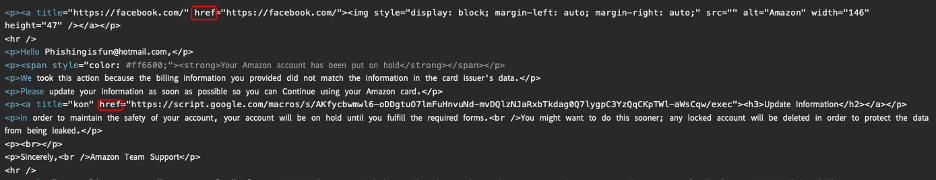
*Screenshot 7: Embeedded Link.*  

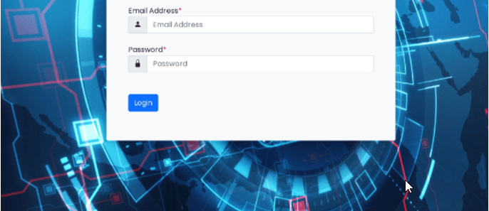

*Screenshot 8: Potential Harvester.*  

---

### 3.2 Base64 Attachment Analysis  
Discovered an PDF attachement encodded in base64

**File**: `Detailsdisable-262340.pdf` (Base64-encoded HTML)  

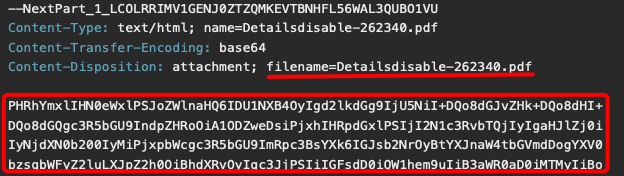  
*Screenshot 9: PDF Attachment.*  

1. **Decoding with CyberChef**:  
   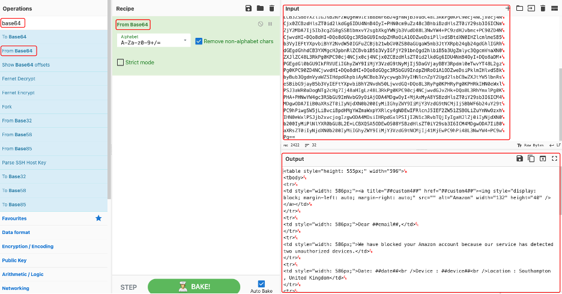
   *Screenshot 10: Decoded in cyberchef.*  
   
2. **I Saved the file to my system as "download.malware" and checked the file type and it wasn't a PDF file rather it was an html file**
   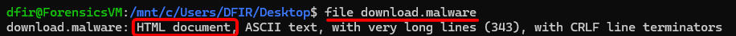
   
   *Screenshot 11: Revealed HTML content instead of PDF.*  

**Risk**: Masquerading HTML as PDF to bypass filters.  

---

## 4. OSINT & Reputation Checks  

### 4.1 Sender Domain (`comunidadeduar[.]com.ar`)  
- **DomainTools**: Created 2013-07-10 (Buenos Aires, Argentina).

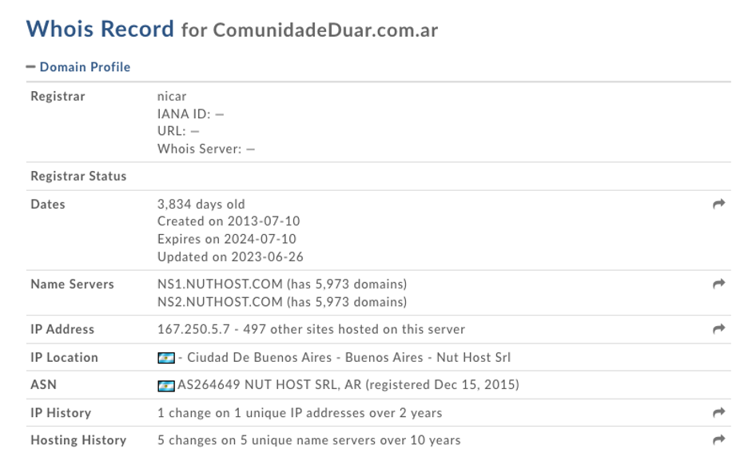  
*Screenshot 12: Domain Information*  

- **VirusTotal**: 4 vendor flagged this domain as malicious  

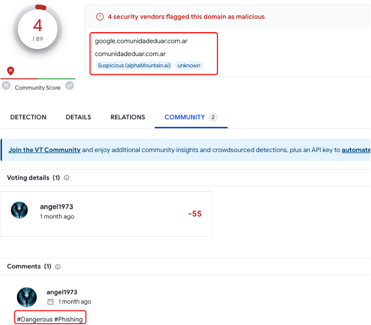  
*Screenshot 13: Virus Total Analysis.*  

### 4.2 Sender IP (`40.107.215.98`)  

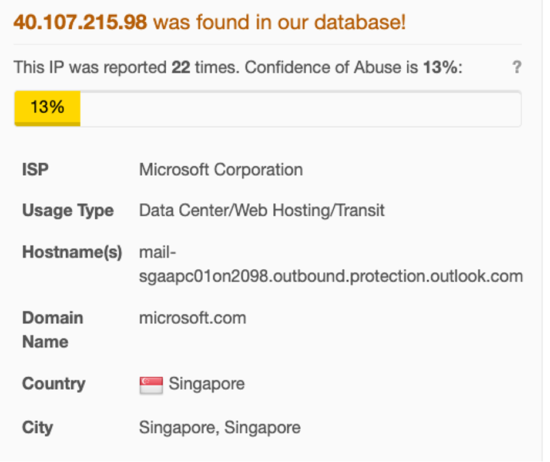  
*Screenshot 14: IP Reputation in AbuseIPDB.*  

- **ISP**: Microsoft (legitimate cloud service IP).  
- **AbuseIPDB**: Spam reports (low weight due to shared infrastructure).  

---

## 5. Conclusions & Recommendations  

### 5.1 Phishing Indicators  
- ✅ **Social Engineering**: Scarcity tactic ("account locked").  
- ✅ **Domain Mismatch**: `comunidadeduar[.]com.ar` vs. "Quick Response".  
- ✅ **Malicious Attachment**: Base64 HTML masquerading as PDF.  
- ✅ **Suspicious URL**: `script.google[.]com/.../exec`.  

### 5.2 Action Items  
1. **Block IoCs**:  
   - Domain: `comunidadeduar[.]com.ar`  
   - Email: `nuthostsrl.SaintU74045Walker@comunidadeduar[.]com.ar`  
   - URL: `script.google[.]com/.../exec`  

2. **Action Items**  
   - **Delete** the email and block the sender.  
   - **Search** SIEM/email gateway logs for subject `"We Locked Your Account for Security Reasons"` and any traffic to/from:
     - `comunidadeduar[.]com.ar`  

3. **Next Steps**  
   - Notify users and the security team of this phishing campaign.  
   - Update email filtering rules to flag future messages from `comunidadeduar[.]com.ar`.  

---

## 6. 1.1 Skills Learned
- Email header forensics: parsing and interpreting Received, Authentication-Results, Message-ID, and X‑headers

- Authentication analysis: understanding SPF, DKIM, and DMARC outcomes and implications

- Mail flow tracing: mapping an email’s journey through multiple servers

- OSINT investigations: performing WHOIS, VirusTotal, AbuseIPDB, and IPVoid lookups on domains and IP addresses

- Social‑engineering detection: recognizing mismatched From/Reply-To, undisclosed recipients, and lure-based subject lines

---

🔧 **Tools Used**: CyberChef, URLScan, Sublime EML Analyzer, whois, VirusTotal.  

---

