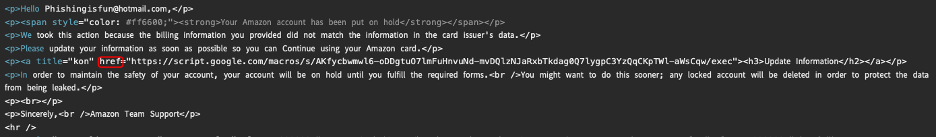

# **Second Phishing Email Analysis Documentation "Account Lockout"**

## 1. Aim

In this lab exercise, I analyzed a suspicious email that falsely claimed the recipient’s account had been locked. The objective was to examine the email's authenticity, identify phishing tactics, and assess the risks using forensic analysis and OSINT tools.

---

## 2. Email Header Analysis

### 2.1 Mail Server Path (`Received` Fields)

*Screenshot 1: Email routed through Microsoft Outlook servers (`outlook.office365[.]com`).*

**Key Observations**:

* The closest mail relay to the sender is `mail-pf1-f856.outlook.office365[.]com`, indicating the use of Microsoft infrastructure.
* The source IP address `40.107.215.98` is owned by Microsoft and considered low-risk due to shared cloud usage.

---

### 2.2 Authentication Results

*Screenshot 2: SPF passed (Microsoft IP), DKIM not configured.*

| **Check** | **Result**        | **Implication**                                       |
| --------- | ----------------- | ----------------------------------------------------- |
| SPF       | **Pass**          | IP is authorized to send on behalf of the domain      |
| DKIM      | **None**          | No cryptographic signature; authenticity unverified   |
| DMARC     | **BestGuessPass** | No explicit DMARC policy; sender domain not validated |

---

### 2.3 Envelope & Display Fields

* **Return-Path**: `nuthostsrl.SaintU74045Walker@comunidadeduar[.]com.ar`
* **From**: `noreply@Quick Response <nuthostsrl.SaintU74045Walker@comunidadeduar[.]com.ar>`
* **To**: Undisclosed recipients
* **Subject**: `We locked your account for security reason - Fri, September 08, 2023 10:11 AM`

*Screenshot 3: Envelope & Display Fields*

**Red Flags**:

* Mismatch between the display name (`noreply@Quick Response`) and the domain (`comunidadeduar[.]com.ar`).
* Urgency tactic used in subject to pressure user action.

---

### 2.4 Message Metadata

* **Date**: `Fri, 8 Sep 2023 10:11:07 +0500`
* **Message-ID**: `<lCoLrriMV1genj0ZtZQMKEVTBnhfL56Wal3quBo1vU@mail-pf1-f856.outlook.office365.com>`
* **X-Mailer**: `WebService/1.1.18291 YMailNorrin` (MacOS Chrome user agent)
* **Content-Type**: `multipart/mixed` with boundary `NextPart`

*Screenshot 4: Message Metadata*

The "X-Mailer" field reveals a webmail client with a MacOS/Chrome user agent. Parsing the user agent string using [User Agent Parser](https://explore.whatismybrowser.com/useragents/parse/#parse-useragent) confirms that the attacker likely used a browser-based email platform.

*Screenshot 5: Attacker used a webmail client (MacOS/Chrome).*

---

## 3. Email Body & Attachments

### 3.1 HTML Content

*Screenshot 6: Fake account lockout warning with urgency.*

**Embedded Suspicious URL**:

* `script.google[.]com/.../exec` — linked via the "Update Information" button, likely leading to a credential harvesting page.

*Screenshot 7: Embedded malicious URL*

*Screenshot 8: Potential credential harvester page*

---

### 3.2 Base64 Attachment Analysis

A base64-encoded file attachment was included, disguised as a PDF.

* **Filename**: `Detailsdisable-262340.pdf`
* **Actual Type**: Encoded HTML file masquerading as a PDF

*Screenshot 9: PDF Attachment*

**Decoding Process**:

1. The attachment was decoded using CyberChef.
   
   *Screenshot 10: Decoded in CyberChef*

2. The decoded file was saved locally as `"download.malware"` and analyzed. It was revealed to be an HTML file, not a PDF.

   
   *Screenshot 11: Revealed HTML masquerading as a PDF*

**Security Implication**:
This technique bypasses many traditional email filters by disguising an HTML payload as a seemingly benign document.

---

## 4. OSINT & Reputation Checks

### 4.1 Sender Domain – `comunidadeduar[.]com.ar`

* **WHOIS Lookup**: Registered on 2013-07-10, hosted in Buenos Aires, Argentina.

*Screenshot 12: Domain Information*

* **VirusTotal**: 4 security vendors flagged this domain as malicious.

*Screenshot 13: VirusTotal Domain Analysis*

---

### 4.2 Sender IP – `40.107.215.98`

*Screenshot 14: IP Reputation in AbuseIPDB*

* **ISP**: Microsoft – shared cloud IP used for legitimate services.
* **AbuseIPDB**: Reported for spam; low confidence due to multi-tenant usage.

---

## 5. Conclusions & Recommendations

### 5.1 Key Phishing Indicators

* ✅ **Social Engineering** – Scarcity and fear (account lockout).
* ✅ **Domain Mismatch** – Sender address does not match display name.
* ✅ **Encoded Malicious Attachment** – HTML file posing as a PDF.
* ✅ **Suspicious Redirect URL** – `script.google[.]com/.../exec` leads to phishing site.

### 5.2 Action Items

1. **Block Identified IoCs**:

   * Domain: `comunidadeduar[.]com.ar`
   * Email: `nuthostsrl.SaintU74045Walker@comunidadeduar[.]com.ar`
   * URL: `script.google[.]com/.../exec`

2. **Containment Measures**:

   * Delete the email from all mailboxes.
   * Search SIEM/email gateway logs for similar subjects:

     * `"We Locked Your Account for Security Reasons"`
   * Investigate any communication or access involving `comunidadeduar[.]com.ar`.

3. **Mitigation & Response**:

   * Notify affected users and security personnel.
   * Update email filters to flag domains mimicking brand communications.
   * Educate users on avoiding credential input via untrusted links.

---

## 6. Skills Learned

* Email header Analysis
* OSINT: WHOIS, VirusTotal, AbuseIPDB lookup.
* Recognizing visual and behavioral social engineering lures

---

🔧 **Tools Used**:

* **CyberChef**
* **URLScan**
* **Sublime EML Analyzer**
* **WHOIS Lookup**
* **VirusTotal**
* **AbuseIPDB**

---
