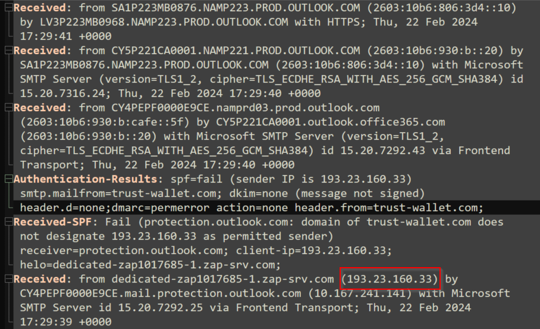
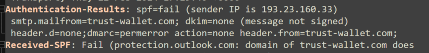
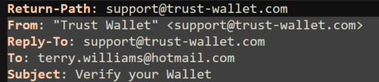
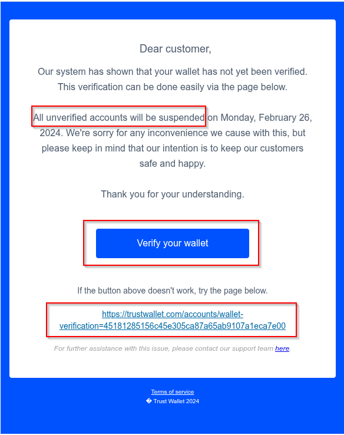
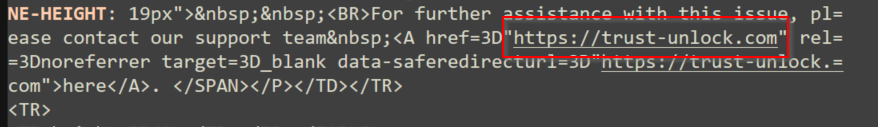
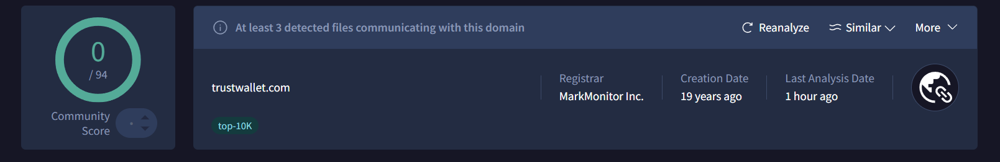
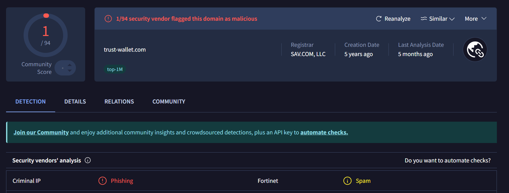

# **Third Phishing Email Analysis Documentation – "Trust Wallet Impersonation"**

## 1. Aim

In this investigation, I conducted an in-depth analysis of a phishing email impersonating **Trust Wallet**, a widely recognized cryptocurrency platform. The objective was to dissect the email's technical details and determine its authenticity using forensic techniques and open-source intelligence (OSINT) tools.

---

## 2. Email Header Analysis

### 2.1 Mail Server Path (`Received` Fields)

*Screenshot 1: Received Fields*

**Key Observations**:

* The email originated from a suspicious IP address: `193.23.160.33`.
* A review of the SPF record for `trustwallet.com` revealed that this IP address (IPv6) is not associated with the legitimate infrastructure of the organization, indicating probable spoofing.

---

### 2.2 Authentication Results

*Screenshot 2: Authentication Results*

| **Check** | **Result**   | **Implication**                                                       |
| --------- | ------------ | --------------------------------------------------------------------- |
| SPF       | **Fail**     | The sending server is not authorized to send on behalf of the domain  |
| DKIM      | Not Provided | Absence of a cryptographic signature to verify authenticity           |
| DMARC     | Likely Fail  | Likely inherited failure due to SPF misalignment, suggesting spoofing |

---

### 2.3 Envelope & Display Fields

*Screenshot 3: Envelop & Display Fields*

| **Field**   | **Value**                            |
| ----------- | ------------------------------------ |
| Return-Path | `support@trust-wallet.com` (spoofed) |
| From        | `support@trust-wallet.com`           |
| To          | `terry.williams@hotmail.com`         |
| Subject     | `Verify your Wallet`                 |

**Red Flags Identified**:

* The display name and email domain closely imitate the official **Trust Wallet** branding.
* The sender domain `trust-wallet.com` (note the hyphen) is not the same as the official `trustwallet.com`.
* The subject line uses urgency to provoke immediate action, a common phishing tactic.

---

## 3. Email Body & Attachments

### 3.1 HTML Content

*Screenshot 4: Body of the email*

**Tactics Used in Email Body**:

* The message invokes urgency: *"Verify your Wallet now"*—a known manipulation method.
* Two embedded URLs identified:

  * A **legitimate link** to `https://trustwallet.com`, likely used to build credibility.
  * A **malicious hyperlink** tied to a button labeled “Verify Your Wallet”, redirecting to:

    > `https://trust-unlock.com`

*Screenshot 5: Malicious Link which mimics the original "trustwallet.com"*

**Analysis**:
The attacker disguises a malicious link beneath a trust-inspiring button. This is a textbook example of **trust exploitation** and **visual deception**, luring users into disclosing sensitive data.

---

## 4. OSINT & Reputation Checks

### 4.1 Domain Analysis

| **Domain**         | **Observation**                                   |
| ------------------ | ------------------------------------------------- |
| `trustwallet.com`  | Legitimate – Official website of Trust Wallet     |
| `trust-wallet.com` | Malicious – Registered with intent to impersonate |
| `trust-unlock.com` | Malicious – Used in phishing redirection          |

*Screenshot 5: VirusTotal Analysis of `trustwallet.com`*

*Screenshot 5: VirusTotal Analysis of `trust-wallet.com`*

* The domain `trust-wallet.com` has been flagged by security vendors for phishing.
* The use of a hyphen is a common deception technique in domain impersonation.

---

## 5. Conclusions & Recommendations

### 5.1 Key Phishing Indicators

* ✅ **SPF Failure** – Email sent from unauthorized IP.
* ✅ **Domain Impersonation** – Use of `trust-wallet.com` to mimic `trustwallet.com`.
* ✅ **Social Engineering** – Subject/body induce urgency.
* ✅ **Malicious Redirect** – Link to `https://trust-unlock.com`.

### 5.2 Recommended Actions

**1. Block Identified IOCs**:

* Domain: `trust-unlock.com`
* IP Address: `193.23.160.33`
* Sender Email: `support@trust-wallet.com`

**2. Containment & Response**:

* Immediately delete the phishing email across all mailboxes.
* Search SIEM or email gateway for the subject line:

  * `"Verify your Wallet"` during February 2024.
* Review logs for sender `support@trust-wallet.com`.
* Investigate outbound connections to `https://trust-unlock.com`.
* If accessed, enforce password resets and session terminations (e.g., Entra ID).

---

## 6. Skills Learned

* Performed forensic **email header analysis**.
* Identified **domain impersonation** and spoofed infrastructure.
* Evaluated embedded links for **deceptive redirection tactics**.
* Leveraged **OSINT tools** (VirusTotal, WHOIS, AbuseIPDB) for threat attribution.

---

🔧 **Tools Utilized**:

* Email Header Analyzer / EML Parser
* VirusTotal
* WHOIS Lookup
* AbuseIPDB
* SIEM Platform (for log correlation)
* Manual link inspection via browser hover analysis

---
