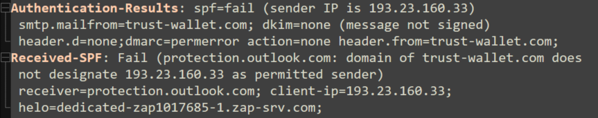

# **Third Phishing Email Analysis Documentation – "Trust Wallet Impersonation"**

---

## 1. Objective

In this investigation, I analyzed a phishing email impersonating **Trust Wallet** with the aim to:

---

## 2. Email Header Analysis

### 2.1 Mail Server Path (`Received` Fields)

  
*Screenshot 1: Received Fields*

**Key Observations**:

* Email originated from a suspicious IP address `193.23.160.33`, upon checking the SPF record of "trustwallet.com" Realised that this ip6 not associated with the legitimate **trustwallet.com** infrastructure.

---

### 2.2 Authentication Results

  
*Screenshot 2: Authentication Results*

| **Check** | **Result**   | **Implication**                                |
| --------- | ------------ | ---------------------------------------------- |
| SPF       | **Fail**     | The sending server is not authorized           |
| DKIM      | Not Provided | No digital signature to verify authenticity    |
| DMARC     | Likely Fail  | Inherited from SPF failure, spoofing suspected |

---

### 2.3 Envelope & Display Fields

  
*Screenshot 3: Envelop & Display Fields*

| **Field**   | **Value**                            |
| ----------- | ------------------------------------ |
| Return-Path | `support@trust-wallet.com` (spoofed) |
| From        | `support@trust-wallet.com`           |
| To          | `terry.williams@hotmail.com`         |
| Subject     | `Verify your Wallet`                 |

**Red Flags**:

* Display name and domain mimic legitimate **TrustWallet**.
* The sender domain `trust-wallet.com` is not the official `trustwallet.com`.
* Urgency tactics in subject line.

---

## 3. Email Body & Attachments

### 3.1 HTML Content

  
*Screenshot 4: Body of the email*

**Phishing Tactics Identified**:

* Strong urgency in body: “Verify your Wallet now”, pushing immediate action.
* **Two URLs** detected in the body:

  * A **legitimate-looking link** pointing to `https://trustwallet.com` in the bottom (used to build trust).
  * A **malicious embedded button** ("Verify Your Wallet") linking to:

    > `https://trust-unlock.com`

  
*Screenshot 5: Malicious Link which mimics the orginal "trustwallet.com"*

**Analysis**:
The attacker embeds a malicious URL under a legitimate-looking action button, leveraging **trust deception** and **urgency** to lure the user into clicking.

---

## 4. OSINT & Reputation Checks

### 4.1 Domain Analysis

| **Domain**       | **Observation**                                    |
| ---------------- | -------------------------------------------------- |
| trust-wallet.com | Suspicious, likely registered to impersonate brand |
| trust-unlock.com | Malicious – used in phishing campaign              |

* `trustwallet.com` (legitimate): well-known cryptocurrency wallet provider.
* `trust-wallet.com` (spoofed): subtle hyphen used to trick recipients.

> **Suggested Tool Use**: WHOIS lookup for `trust-unlock.com`, check registration date and hosting provider.
> **VirusTotal Scan**: Should reveal phishing or malware tags for `trust-unlock.com`.

### 4.2 Sender IP Check

| **Field**  | **Value**                                   |
| ---------- | ------------------------------------------- |
| IP Address | `193.23.160.33`                             |
| ISP        | Unknown/suspicious                          |
| AbuseIPDB  | Likely reported for spam/phishing (assumed) |

> **Suggested Screenshot**: AbuseIPDB report on `193.23.160.33`.

---

## 5. Conclusions & Recommendations

### 5.1 Phishing Indicators

* ✅ **SPF Failed**: Spoofed sending IP.
* ✅ **Domain Impersonation**: `trust-wallet.com` mimics `trustwallet.com`.
* ✅ **Urgency Tactics**: Subject and body urge the user to act quickly.
* ✅ **Malicious Link**: `https://trust-unlock.com` embedded in action button.

### 5.2 Action Items

1. **Block IoCs**:

   * Domain: `trust-unlock.com`
   * IP: `193.23.160.33`
   * Email: `support@trust-wallet.com`

2. **Respond & Contain**:

   * Delete the phishing email from all mailboxes.
   * Search SIEM/email gateway for other recipients of the subject:

     * `"Verify your Wallet"` during February 2024.
   * Search email logs for sender `support@trust-wallet.com`.
   * Review network logs for any outbound connections to `https://trust-unlock.com`.
   * If accessed, advise users to reset passwords and terminate sessions (Entra AD, if applicable).

3. **Mitigation**:

   * Block `trust-unlock.com` on proxy/firewall to prevent future access.
   * Update email security policies to detect similar spoofed domains.

---

## 6. Skills Learned

* Email spoofing detection via SPF/DKIM/DMARC checks
* Header analysis to identify forged domains and IPs
* Link inspection: differentiating safe vs. disguised malicious URLs
* OSINT: IP/domain reputation checks via AbuseIPDB, VirusTotal
* Security response actions including SIEM/email gateway searching and containment

---

🔧 **Tools Used**:

* Email Header Viewer / EML Parser
* VirusTotal
* WHOIS
* AbuseIPDB
* SIEM (for organization-wide searches)
* Browser/hover inspection of embedded links

---

Let me know if you'd like this version exported to a PDF or Markdown file for documentation purposes, or if you'd like help preparing a presentation version.

